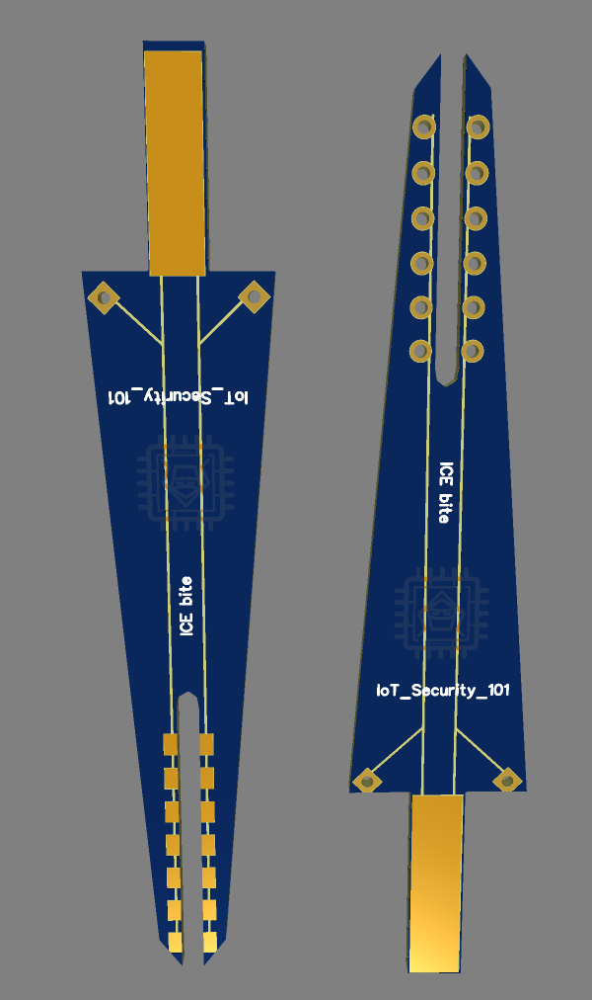

# ICEBite

# Introducing ICE-Bite from IoTSecurity101 - Solderless Testing Probes

Inspired by the renowned Pizzabite from the WHID team, we proudly present ICE-Bite, a cost-effective, open-hardware alternative tailored for the Indian market. Designed with affordability and accessibility in mind, ICE-Bite offers a budget-friendly solution for holding your PCB securely during soldering or inspection tasks.

## Key Features:

| **Product**                                                                                                  | **Image**                                                                                                            | **Link**                                                                                          | Description | 
|--------------------------------------------------------------------------------------------------------------|----------------------------------------------------------------------------------------------------------------------|-------------------------------------------------------------------------------------------------------|-------------------------------------------------------------------------------------------------------|
| **Ice-bite**  |     | |  This innovative tool ensures precision and convenience without the need for soldering, making it an essential addition to any technician tool kit |
| **Flexible Arms Soldering Station With Swiveling Alligator Clip**                                            |                                                                                                   | [Product Link](https://robu.in/product/six-flexible6-arm-soldering-station-wo-usb-fan/)               |
|                                                                                                              |                                                                                                                                                            |
|                                                                                                              |                                                                                                                      | - Includes 6 silicon clip tips for superior heat resistance                                           |
| **Spring Test Probe Pogo Pin P100-B1 Dia 1.36 mm**                                                           |                                                                                       | [Product Link](https://www.farnell.com/datasheets/3968496.pdf)                                        |
|                                                                                                              |                                                                                                                      | **Description:** High-quality pogo pins with a diameter of 1.36mm for reliable electrical connections. |
|                                                                                                              |                                                                                                                      | [Datasheet](https://www.farnell.com/datasheets/3968496.pdf)                                           |
| **Proskit SN-390 Metal Adjustable Soldering Clamp Holder** (Optional)                                        |                                                                                           | [Product Link](https://www.amazon.in/Proskit-SN-390-Adjustable-Soldering-Multicolour/dp/B07JKLC61F?th=1) |
|                                                                                                              |                                                                                                                      | **Description:** A sturdy soldering clamp holder, accommodating PCBs up to 9 inches wide.             |
|                                                                                                              |                                                                                                                      | **Budget Options:** Similar soldering holders available for as low as INR 150.                         |

Additionally, detailed PCB diagrams are available via the provided link for easy reference and assembly.

ICE-Bite from IoTSecurity101 offers a practical and affordable solution for soldering and inspection needs, empowering DIY enthusiasts and professionals alike to enhance their projects without breaking the bank.

## Contributors:
1. [K Ekanathan](https://github.com/kekanath)
2. [Mr-IoT](https://github.com/V33RU)
